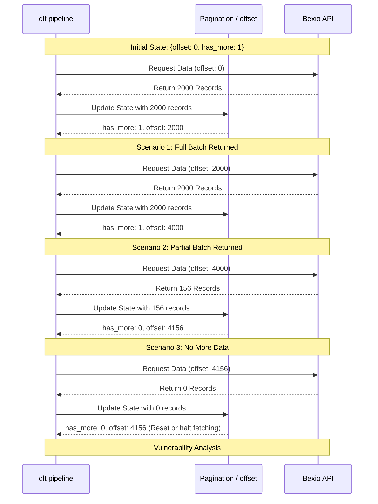
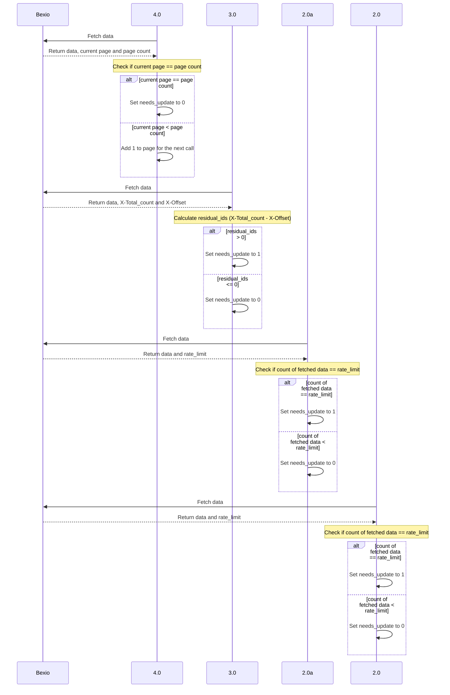

# bexio-dlt-connector

Bexio REST API → [dlt](https://dlthub.com/) with **OAuth**, flattened entities, and **PSA-style SCD2** loads to **DuckDB** or **Snowflake**.

This repository continues the connector work previously kept under `ft_customconnector_bexio` (local folder `FT_CustomConnector_Bexio`). Use **this** repo name for new Git remotes and Docker image tags.

---

For **OAuth, refresh rotation, and env vars**, see [AUTHENTICATION.md](AUTHENTICATION.md).

**Local checks (no API):** `pip install -r requirements-dev.txt && pytest`

## Run with dlt in Docker

1. Ensure `.env` has OAuth: `BEXIO_CLIENT_ID`, `BEXIO_CLIENT_SECRET`, and `BEXIO_REFRESH_TOKEN` or `BEXIO_REFRESH_TOKEN_FILE` (from `python oauth_login.py`). PATs are not used.
2. Build the container:
   `docker build -t bexio-dlt-connector .`
3. Run the pipeline. Mount `.dlt` for dlt state (image runs as `appuser`; home is `/home/appuser`). For **automatic refresh-token rotation**, use a writable file mount (create the host file once: `touch bexio_refresh_token`):
   `docker run --rm --env-file .env -v "$(pwd)/.dlt:/home/appuser/.dlt" -e BEXIO_REFRESH_TOKEN_FILE=/run/bexio/refresh_token -v "$(pwd)/bexio_refresh_token:/run/bexio/refresh_token" bexio-dlt-connector`
   Omit the refresh file mount if you only use env-based `BEXIO_REFRESH_TOKEN` (IdP rotation may then require updating the secret store yourself).

The pipeline writes data with `dlt` using **PSA SCD2** (`merge` + `scd2` + `row_hash` excluding `_loaded_at` / `_extract_run_id`). Default destination is **DuckDB**; set `BEXIO_DLT_DESTINATION=snowflake` for Snowflake (see [dlt Snowflake](https://dlthub.com/docs/dlt-ecosystem/destinations/snowflake)). Dataset defaults to `bexio` (`BEXIO_DLT_DATASET_NAME`).

