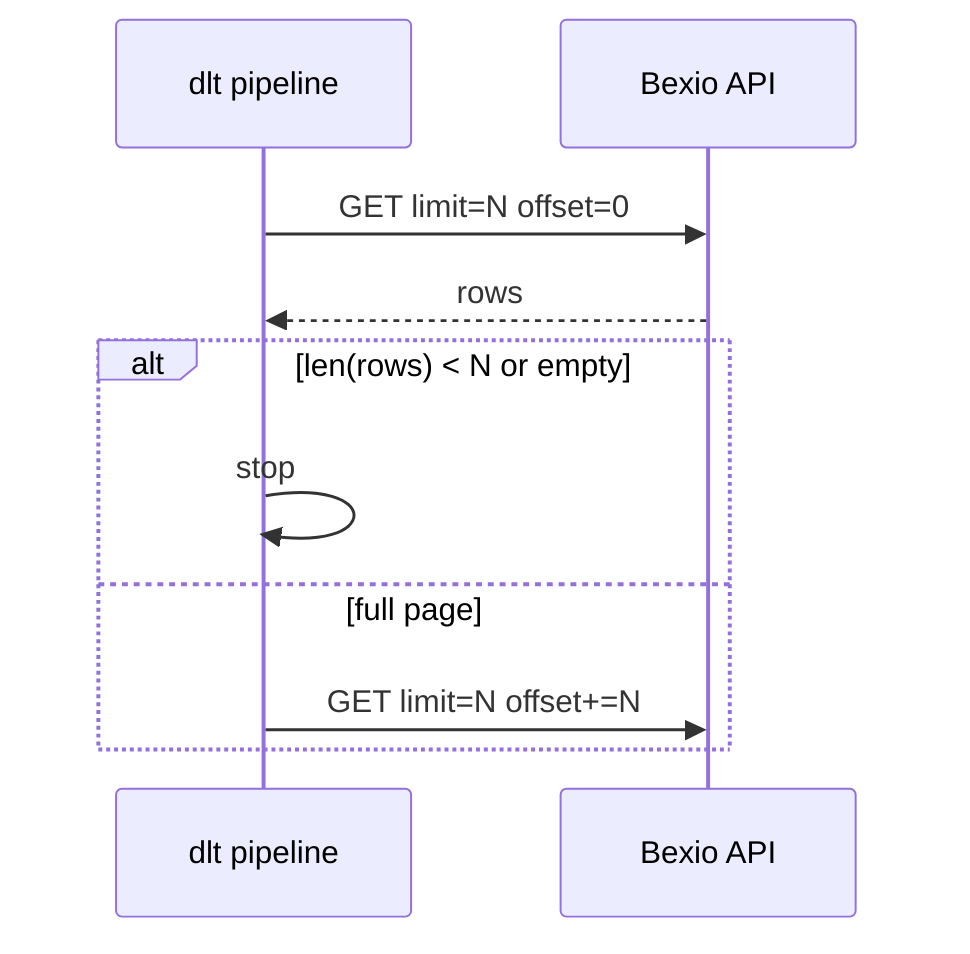

# bexio-dlt-connector

**Repository:** [github.com/svc-bi-concepts/bexio-dlt-connector](https://github.com/svc-bi-concepts/bexio-dlt-connector)

Extract [Bexio](https://www.bexio.com/) data via the REST API into **[dlt](https://dlthub.com/)** with **OAuth** (no personal access tokens in this codebase), JSON **flattening**, and **PSA-style type-2 history** (`merge` + `scd2` + business-only `row_hash` so `_loaded_at` / `_extract_run_id` do not force a new version every run).

**Destinations:** DuckDB (default) or Snowflake. **Docs:** [AUTHENTICATION.md](AUTHENTICATION.md) (OAuth, refresh rotation), [IMPROVEMENT_PLAN.md](IMPROVEMENT_PLAN.md) (roadmap).

This project supersedes the earlier **`ft_customconnector_bexio`** / `FT_CustomConnector_Bexio` layout; use this repo and the **`bexio-dlt-connector`** Docker image name going forward.

---

## Quick start (local)

1. Clone and enter the repo:

   ```bash
   git clone https://github.com/svc-bi-concepts/bexio-dlt-connector.git
   cd bexio-dlt-connector
   ```

2. Python 3.11+ recommended. Create a venv and install dependencies:

   ```bash
   python3 -m venv .venv
   source .venv/bin/activate   # Windows: .venv\Scripts\activate
   pip install -r requirements.txt
   ```

3. Create a **`.env`** file with OAuth variables (see [AUTHENTICATION.md](AUTHENTICATION.md)). One-time token bootstrap:

   ```bash
   pip install -r requirements.txt   # includes deps for oauth_login
   python oauth_login.py
   ```

4. Run the pipeline (writes DuckDB file named from `BEXIO_DLT_PIPELINE_NAME`, default `bexio_pipeline.duckdb` in the working directory):

   ```bash
   python dlt_pipeline.py
   ```

### Main environment variables

| Variable | Purpose |
|----------|---------|
| `BEXIO_CLIENT_ID`, `BEXIO_CLIENT_SECRET` | OAuth app credentials |
| `BEXIO_REFRESH_TOKEN` or `BEXIO_REFRESH_TOKEN_FILE` | Refresh token (file preferred for rotation persistence) |
| `BEXIO_DLT_DESTINATION` | `duckdb` (default) or `snowflake` |
| `BEXIO_DLT_DATASET_NAME` | dlt dataset / schema (default `bexio`) |
| `BEXIO_DLT_PIPELINE_NAME` | dlt pipeline name; DuckDB filename stem (default `bexio_pipeline`) |
| `PIPELINE_RUN_ID` / `SNOWFLAKE_JOB_ID` | Optional; stored per row as `_extract_run_id` |

Snowflake destination setup: [dlt Snowflake destination](https://dlthub.com/docs/dlt-ecosystem/destinations/snowflake).

---

## Tests (no Bexio API calls)

```bash
pip install -r requirements-dev.txt
pytest
```

---

## Docker

1. Build:

   ```bash
   docker build -t bexio-dlt-connector .
   ```

2. Run with `.env` and persisted dlt state. For **automatic refresh-token rotation**, mount a writable refresh-token file (create on the host once, e.g. `touch bexio_refresh_token`):

   ```bash
   docker run --rm --env-file .env \
     -v "$(pwd)/.dlt:/home/appuser/.dlt" \
     -e BEXIO_REFRESH_TOKEN_FILE=/run/bexio/refresh_token \
     -v "$(pwd)/bexio_refresh_token:/run/bexio/refresh_token" \
     bexio-dlt-connector
   ```

The image runs as non-root user **`appuser`** (`/home/appuser` is the home directory). If you only inject `BEXIO_REFRESH_TOKEN` via env and the IdP rotates the refresh token, update your secret store manually unless you use a file mount as above.

---

## Pagination (this pipeline)

The extractor uses **offset/limit** paging per endpoint. A page shorter than `limit` (or empty) ends the loop. Some endpoints use a smaller page size (e.g. bills and expenses at **500**).



---

## Behaviour notes

- **403 / 404** on an endpoint: logged as skipped; the run continues with other endpoints.
- **SCD2:** `primary_key` is Bexio **`id`**; `row_hash` covers business columns only (see `dlt_pipeline.py`).
